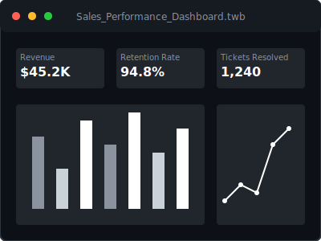

<!-- README IN ENGLISH -->

  
    
  <h1>👋 Hello there! I'm Ariel Alaio</h1>
  
<b>Data Analyst bridging the gap between customer reality and business performance.</b>

  

    
    
  

---

### 💼 Who I am & How I work

I transition **KPI discipline, deep stakeholder empathy, and process optimization** from years of high-volume customer service directly into **actionable data analytics**. Having de-escalated critical issues and managed strict performance metrics under pressure, I look at data not just as numbers, but as the underlying story of customer behavior and operational efficiency.

#### 🚀 The Big Three (Core Stack)

  
  
  
  

#### ⚙️ My 3-Step Project Workflow
1. **Understand reality:** Translate business questions into precise data requirements. What gets measured gets managed.
2. **Mine & Refine:** Use SQL/Excel to clean, aggregate, and structure raw data, solving documentation gaps upfront.
3. **Deliver Insight:** Build intuitive Tableau dashboards that executives can read in 5 seconds to make decisions.

> **What I need from you to start a project:**  
> Access to a data source (CSV/DB), a clear business objective (e.g., "increase retention by X%"), and 15 minutes with the key stakeholder.

---

### 📊 GitHub Statistics

  
  

---

### 🔬 Featured Projects & Learning

**Dashboard Preview:**

  

* **Currently Learning:** Advanced Window Functions in SQL & Statistical Modeling (leveraging my Psychology degree background).
* **Fun Fact:** My background in Psychology acts as a cheat code for understanding UX/UI in dashboards and user retention metrics!

  

---
<!-- README EN ESPAÑOL -->

  <h1>👋 ¡Hola! Soy Ariel Alaio</h1>
  
<b>Analista de Datos conectando la realidad del cliente con el rendimiento del negocio.</b>

---

### 💼 Quién soy y cómo trabajo

Transformo años de experiencia en servicio al cliente de alto volumen en **análisis de datos accionables**, aplicando disciplina en KPIs, empatía con el cliente y optimización de procesos. Al haber gestionado métricas estrictas bajo presión, no veo los datos solo como números, sino como la historia subyacente del comportamiento del usuario y la eficiencia operativa.

#### 🚀 Mis Herramientas Principales

  
  
  

#### ⚙️ Mi flujo de trabajo en 3 pasos
1. **Entender la realidad:** Traducir preguntas de negocio en requisitos de datos precisos.
2. **Minar y Refinar:** Usar SQL/Excel para limpiar y estructurar datos crudos.
3. **Entregar Insights:** Crear dashboards intuitivos en Tableau para toma de decisiones rápidas.

> **Qué necesito para empezar un proyecto:**  
> Acceso a los datos, un objetivo de negocio claro y 15 minutos con el líder del proyecto.

* **Aprendiendo actualmente:** Funciones de ventana avanzadas en SQL y Modelado Estadístico.
* **Dato Curioso:** ¡Mi formación en Psicología es una gran ventaja para entender la retención de usuarios y el comportamiento del consumidor en los dashboards!
