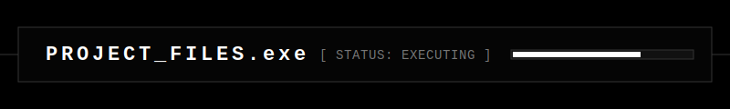

<!-- README IN ENGLISH -->

  
    
  <h1>👋 Hello, I'm Ariel</h1>
  
<b>Data analysis with one goal: measurable impact.</b>

  

    
    
  

---

  

### 💼 A Reliable Partner for Your Business Decisions

I don't just "process data." I bridge the gap between complex numbers and real-world business growth. With a background in **Psychology** and years of experience managing high-pressure environments in Public Administration and Tech Support, I bring a unique "Human-First" perspective to data.

**Why trust me with your data?**
*   **Total Reliability:** I understand that every decimal affects a decision. Accuracy is my baseline, not my goal.
*   **Stakeholder Empathy:** My psychology background allows me to translate technical findings into language that executives and clients actually care about.
*   **Execution Under Pressure:** I thrive in fast-paced environments where KPIs are the only thing that matters.

---

  

#### 🚀 Technical Arsenal (Pure Focus)

  
  
  
  

---

  <h3>⚙️ My Dynamic Workflow</h3>
  

1.  **Empathy-Driven Discovery:** I start by listening to your business needs, not just looking at table schemas.
2.  **Meticulous Analysis:** Using SQL & Tableau to uncover the "why" behind the "what."
3.  **Measurable Impact:** Delivering insights that lead to higher retention, cleaner processes, and better ROI.

---

  

| Project Title | Role / Tech Stack | Impact | Link |
| :--- | :--- | :--- | :--- |
| **[Featured Analysis]** | Data Analyst • Tableau, SQL | *Ready for your first big project. Impact focused.* | `[Link ->]` |

---

### 📊 GitHub Statistics

  
  

 

  

---
<!-- README EN ESPAÑOL -->

  <h1>👋 Hola, soy Ariel</h1>
  
<b>Análisis de datos con un único objetivo: impacto medible.</b>

---

### 💼 Un socio confiable para tus decisiones de negocio

Mi valor no está solo en "procesar datos", sino en conectar números complejos con el crecimiento real de la empresa. Gracias a mi formación en **Psicología** y años de experiencia bajo presión en Administración Pública y Soporte Técnico, aporto una perspectiva humana y estratégica que los perfiles puramente técnicos suelen pasar por alto.

**¿Por qué confiar en mí?**
*   **Confiabilidad Absoluta:** Entiendo que cada dato mal interpretado es una mala decisión de negocio. La precisión es mi punto de partida.
*   **Empatía con Stakeholders:** Traduzco hallazgos técnicos al lenguaje de negocios que a los ejecutivos les interesa.
*   **Disciplina en KPIs:** Mi experiencia me ha enseñado a trabajar bajo métricas estrictas y entregar resultados que mueven la aguja.

---

  

